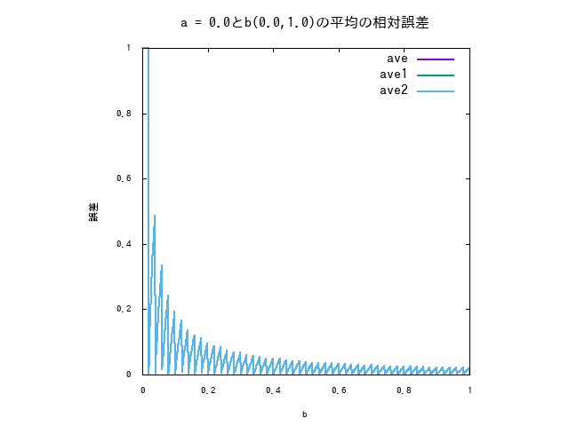
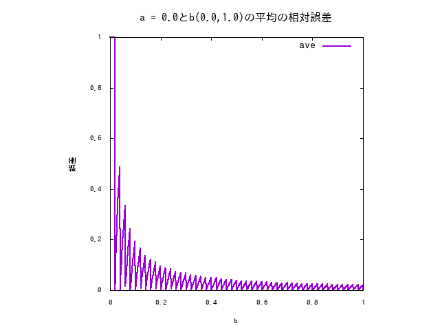
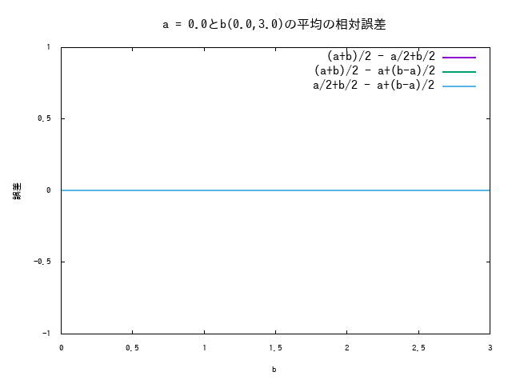

# SignDig
## 概要
(a+b)/2, a/2+a/2, a+(b-a)/2のどれが数値計算を行う上で美味しいかを調べる用のプログラムです。
## 使いかた
a, bは区間として
```
$ ./SignDig a b
```
## 今までの課題
### 1. 作成
a/2+b/2とa+(b-a)/2のどちらが美味しいかを調べるプログラムの作成
### 2. グラフの作成
(a+b)/2, a/2+b/2,a+(b-a)/2の相対誤差をaを固定して閉区間[a,b]の間でbを動かしたときのグラフを作成。以下そのサンプル画像





### 3. 相対誤差の差分を取る
(a+b)/2, a/2+b/2, a+(b-a)/2のそれぞれの総体誤差の差分を作成するグラフの作成。以下そのサンプル画像


